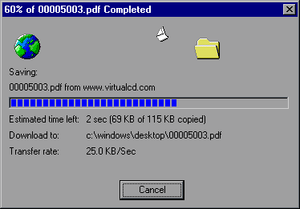



## Download File

### Description

* UPDATED Jan 5, 2001 *

Download files using HTTP protocol with RESUME, MSIE-style animation, status, and progress bar using Microsoft VB6.

* Fixed: The download success is now returned by DownloadFile, as advertised.
 
### More Info
 
strURL: String; The source URL of the file

strDestination String; Valid Win95/NT path and filename for the downloaded file (i.e. "C:\Program Files\My Stuff\Purina.pdf")

Username: Optional;String; Login Username

Password: Optional;String; Login Password

The modGlobals module also contains some functions I designed to format time, file sizes, and fit text to a control's width (like MSIE's download window does)

Usage Example:

Success = frmDownload.DownloadFile("http://myserver.com/myfile.zip","C:\Windows\Desktop\myfile.zip")

If Success then MsgBox "Download successful!"

Dependencies:

Microsoft Internet Transfer Control 6.0 (MSINET.OCX)

Microsoft Windows Common Controls 6.0 (MSCOMCTL.OCX)

Microsoft Windows Common Controls-2 6.0 (MSCOMCT2.OCX)

I believe this will WORK with VB5 Service Pack 3, but the progress indicators will probably not change until the file is completely downloaded due to a limitation in the GetChunk method of the Internet Transfer Control 5.0.

I usually don't like to rely on VB controls (OCX's) for anything, but since the app I wrote for my company had need of 90% of the Windows controls included between the 3 OCX's, it seemed like an efficient use of time and resources! I may get around to writing this using 100% API, but I doubt it will happen soon! Any takers...?

Boolean; True, if file downloaded successfully.

             |
---                |---
**Submitted On**   |2001-01-05 18:19:02
**By**             |[Jeff Cockayne](https://github.com/Planet-Source-Code/PSCIndex/blob/master/ByAuthor/jeff-cockayne.md)
**Level**          |Intermediate
**User Rating**    |4.8 (130 globes from 27 users)
**Compatibility**  |VB 5\.0, VB 6\.0
**Category**       |[Internet/ HTML](https://github.com/Planet-Source-Code/PSCIndex/blob/master/ByCategory/internet-html__1-34.md)
**World**          |[Visual Basic](https://github.com/Planet-Source-Code/PSCIndex/blob/master/ByWorld/visual-basic.md)
**Archive File**   |[CODE\_UPLOAD13434152001\.zip](https://github.com/Planet-Source-Code/jeff-cockayne-download-file__1-7335/archive/master.zip)

